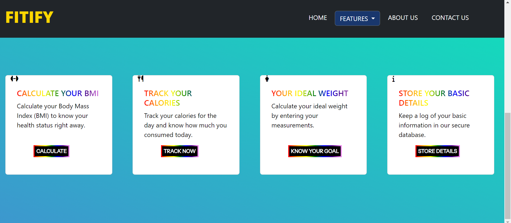

# 🚀 FITIFY - Fitness Tracking Website 🚀

FITIFY is a fitness tracking website built using HTML, CSS, Javascript, Node.js, Express. It provides various features for calculating, tracking and managing your fitness-related information. It is designed to help you in your fitness journey by providing powerful tools to track your progress. 

## Table of Contents
- [Screenshorts](#screenshorts)
- [Features](#features)
- [Built With](#built-with)
- [Links](#links)
- [Author](#author)

## Screenshorts

## Features

The website includes the following features:

- **BMI Calculator**: Calculate your Body Mass Index (BMI) based on your height and weight.
- **Calorie Calculator**: Calculate your calorie intake and other nutritional data by tracking your meals.
- **Ideal Weight Calculation**: Calculate your ideal weight based on your height and bmi.
- **User Data Storage**: Store and manage user data using MongoDB.
- **External API Integration**: Utilize the EDAMAM API for retrieving nutritional information and tracking calories.

## Built With

- HTML
- CSS
- JavaScript
- Node.js
- Express
- Mongoose (MongoDB)
- Integration with EDAMAM API

## Links

- Live Site: [Click Here](https://fitify-fitness-tracker.netlify.app/)
- Source Code Repo: [Click Here](https://github.com/chayansurana3/FITIFY-Fitness-Tracker.git)

## Author

- Chayan Surana
- [Linkedin](https://www.linkedin.com/in/chayan-surana-a93857136/)
- Email - chayan.surana3@gmail.com
- Contact- +91 6262675641