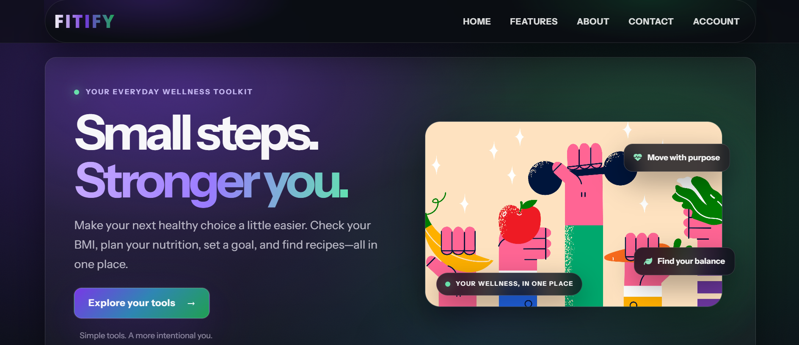
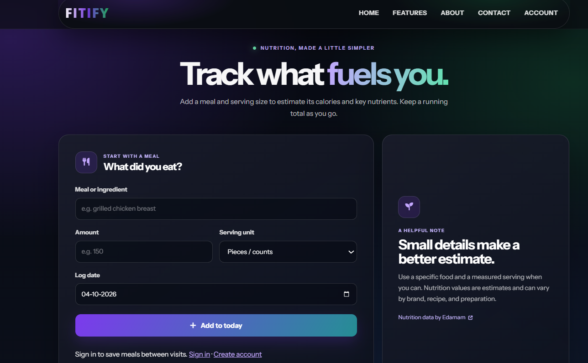
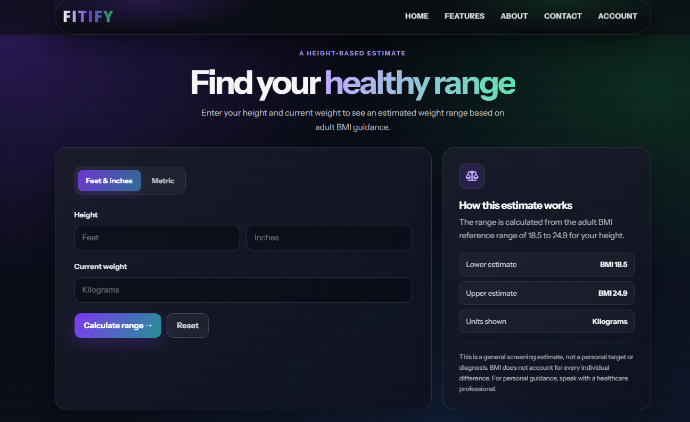
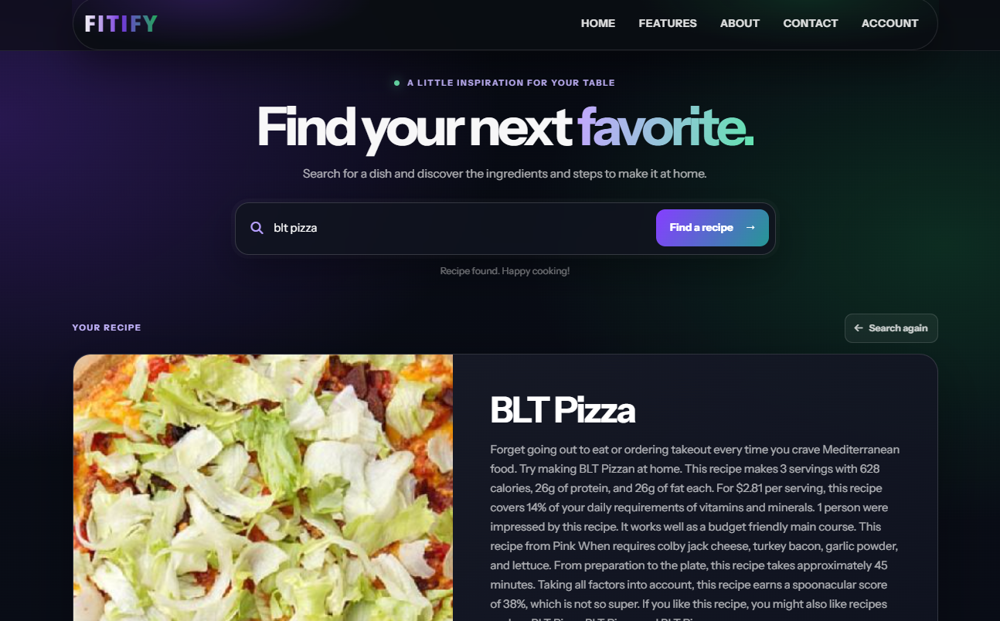

<div align="center">
  <h1>FITIFY</h1>
  <p><strong>Small steps. Stronger you.</strong></p>
  <p>A personal wellness toolkit for checking in, making informed food choices, and building consistent habits.</p>
  <p>
    <a href="https://fitify-fitness-tracker.netlify.app/"><strong>Open FITIFY ↗</strong></a>
    &nbsp; · &nbsp;
    <a href="https://github.com/chayansurana3/FITIFY-Fitness-Tracker">View the source</a>
  </p>
  <p>
    
    
    
    
    
  </p>
</div>

---

## A clearer picture of your progress

FITIFY brings a set of practical wellness tools into one calm, easy-to-use experience. Visitors can explore the calculators, estimate nutrition, and find recipes without creating an account. An account adds a private dashboard for keeping profile details and tracking selected measurements and meals over time.

> FITIFY is an informational wellness project. BMI and weight-range results are general estimates, not medical advice or a diagnosis.

## Explore the experience

<table>
  <tr>
    <td width="50%" align="center">
      <a href="./Screenshot1.png"></a><br />
      <strong>Home</strong><br />A welcoming starting point for the FITIFY toolkit.
    </td>
    <td width="50%" align="center">
      <a href="./Screenshot2.png"></a><br />
      <strong>Wellness tools</strong><br />A quick overview of the calculators, recipe finder, and dashboard.
    </td>
  </tr>
  <tr>
    <td width="50%" align="center">
      <a href="./Screenshot3.png"></a><br />
      <strong>BMI calculator</strong><br />A quick estimate with metric and imperial inputs and explanatory ranges.
    </td>
    <td width="50%" align="center">
      <a href="./Screenshot4.png"></a><br />
      <strong>Calorie tracker</strong><br />Estimate calories and key nutrients for a meal and serving size.
    </td>
  </tr>
  <tr>
    <td width="50%" align="center">
      <a href="./Screenshot5.png"></a><br />
      <strong>Healthy-weight estimate</strong><br />Explore a height-based range using general adult BMI guidance.
    </td>
    <td width="50%" align="center">
      <a href="./Screenshot6.png"></a><br />
      <strong>Recipe finder</strong><br />Search for meal inspiration, ingredients, and cooking steps.
    </td>
  </tr>
</table>

## What you can do

### Understand your measurements

- **BMI calculator** — enter height and weight in metric or imperial units and get a general screening estimate with category guidance.
- **Healthy-weight estimate** — see an estimated weight range for a given height, based on an adult BMI reference range.
- **Color-coded feedback** — interpret calculator results at a glance while keeping the context that these measures are limited estimates.

### Make food choices with more context

- **Calorie and nutrition tracker** — look up a food and serving size to estimate calories, protein, carbohydrates, fat, and fibre.
- **Date-based meal journal** — review meal logs grouped by date, with the newest dates first.
- **Guest mode** — meal logs are saved in the browser’s local storage on that device. They remain available without an account, but do not sync across browsers or devices.
- **Recipe finder** — discover recipes with ingredients, summaries, preparation details, and cooking steps.

### Keep a private progress history

- **FITIFY account and dashboard** — manage profile details, preferred units, fitness focus, and an optional daily calorie goal.
- **Weight and BMI history** — save check-ins and calculator results to revisit changes over time.
- **Account security controls** — verify email, recover or change a password, sign out, and delete an account with its saved FITIFY history.
- **Private meal history** — signed-in meal logs are stored with the account and can be viewed from the tracker and dashboard.

## How the data works

FITIFY keeps guest and account tracking separate. Guest meal entries stay in that browser’s local storage. When signed in, saved measurements and meals are associated with the account in MongoDB. External nutrition and recipe information comes from Edamam and Spoonacular respectively.

## Built with

| Layer | Technology |
| --- | --- |
| Front end | HTML, CSS, JavaScript, Bootstrap |
| Server functions | Node.js and Netlify Functions |
| Account and history storage | MongoDB with Mongoose |
| Nutrition estimates | Edamam API |
| Recipe search and details | Spoonacular API |
| Transactional email | SMTP with Nodemailer |

## Project layout

```text
public/                 Pages, styles, and browser-side interactions
netlify/functions/      Serverless endpoints for account and wellness features
netlify/lib/            Shared account models and server utilities
```

## Project

- **Live website:** [fitify-fitness-tracker.netlify.app](https://fitify-fitness-tracker.netlify.app/)
- **Source repository:** [FITIFY-Fitness-Tracker](https://github.com/chayansurana3/FITIFY-Fitness-Tracker)

## Author

**Chayan Surana**<br />
[LinkedIn](https://www.linkedin.com/in/chayan-surana-a93857136/) · [Email](mailto:chayan.surana3@gmail.com)
