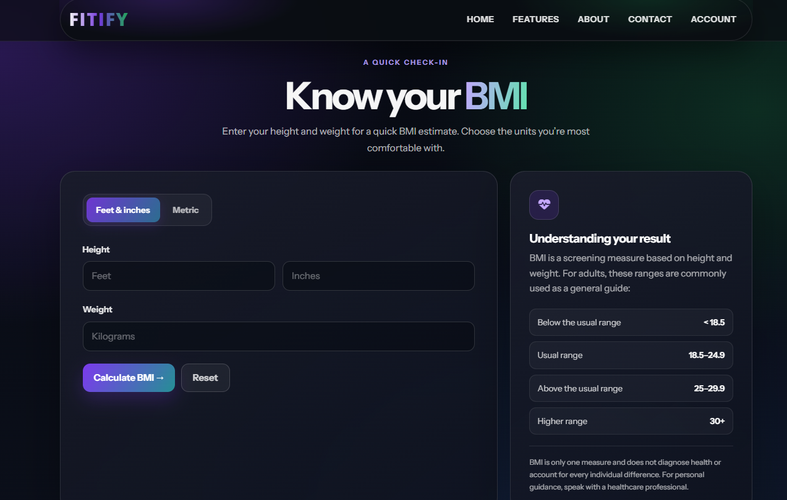
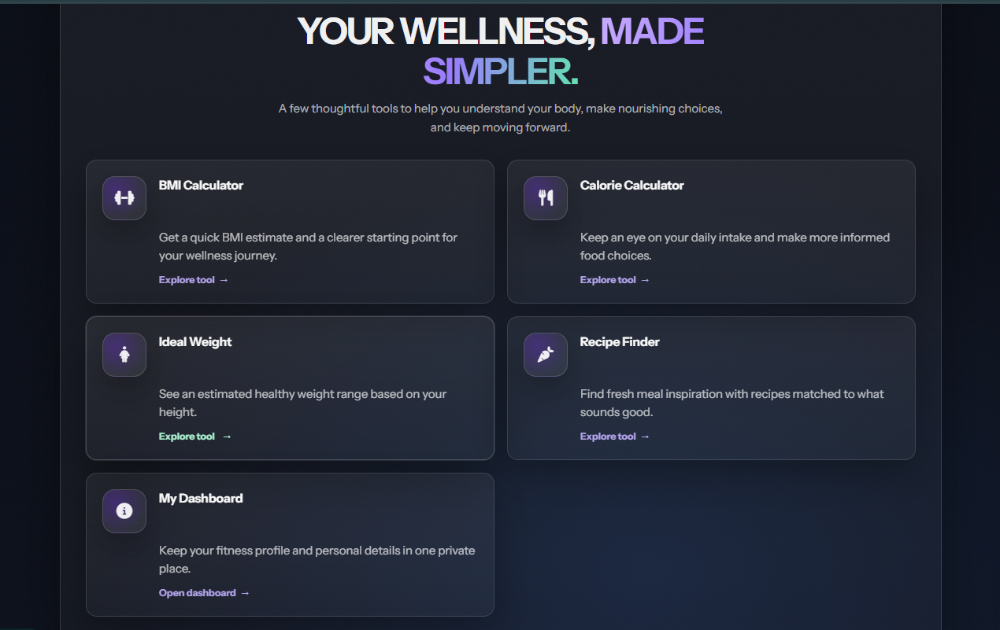

# 🚀 FITIFY - Fitness Tracking Website 🚀

FITIFY is a fitness tracking website built using HTML, CSS, Javascript, Node.js, Express. It provides various features for calculating, tracking and managing your fitness-related information. It is designed to help you in your fitness journey by providing powerful tools to track your progress. 

## Table of Contents
- [Screenshorts](#screenshorts)
- [Features](#features)
- [Built With](#built-with)
- [Links](#links)
- [Author](#author)

## Screenshorts



## Features

The website includes the following features:

- **BMI Calculator**: Calculate your Body Mass Index (BMI) based on your height and weight.
- **Calorie Calculator**: Calculate your calorie intake and other nutritional data by tracking your meals.
- **Ideal Weight Calculation**: Calculate your ideal weight based on your height and bmi.
- **Recipe Finder**: Find delicious recipes to satisfy your cravings.
- **Private FITIFY Dashboard**: Create an account, save profile preferences, and view a BMI estimate based on saved height and weight.
- **External API Integrations**: Utilize the SPOONACULAR API & EDAMAM API for retrieving nutritional information and tracking calories.  

## Built With

- HTML
- CSS
- Bootstrap
- JavaScript
- Node.js
- Express
- Mongoose (MongoDB)
- Integrations with SPOONACULAR API AND EDAMAM API

## Local development

Run the complete site, including Netlify Functions, with either command:

```sh
npm run dev
# or
npm run serve
```

This uses Netlify CLI to serve the `public` folder and functions from `netlify/functions`. The local environment needs `MONGODB_URI` (or both `MONGODB_USERNAME` and `MONGODB_PASSWORD`) in `.env`. New account verification and password recovery also need a Resend API key and a verified sender address. Keep all secrets out of source control. The BMI and ideal-weight calculators work without an account; account creation, sign-in, and dashboard access require the database connection.

Copy `.env.example` to `.env`, then fill in the values locally and restart `npm run serve`:

- `MONGODB_URI`: MongoDB Atlas connection string. URL-encode special characters in the password. The application stores account data in the `FITIFY_PROFILES` database and collections prefixed `fitify_`.
- `RESEND_API_KEY`: create an API key in Resend.
- `EMAIL_FROM`: sender identity on a domain verified in Resend (for example, `FITIFY <no-reply@your-domain.com>`). Resend's sandbox sender only allows delivery to authorized test recipients; verify your own domain for real account emails.
- `SITE_URL`: the public origin used to construct verification and password-reset links. Keep `http://localhost:8888` for local development; set the deployed site URL in Netlify environment variables.
- `EDAMAM_API_ID` and `EDAMAM_API_KEY`: used by the nutrition lookup endpoint.

Never commit `.env` or share its values in screenshots or chat.

New accounts are stored in `fitify_accounts`; sessions and short-lived email tokens are stored in `fitify_sessions` and `fitify_account_tokens`. Saved BMI, weight, and meal entries live in `fitify_bmi_history`, `fitify_weight_history`, and `fitify_meal_history`. All history is scoped to the signed-in account. The dashboard includes recent BMI and weight entries and recent daily calorie totals. BMI and weight logs update the current profile snapshot. Account deletion removes the account and its associated saved data. The previous four-digit-code profile endpoints have been retired; existing legacy profile documents are not automatically imported into new accounts.

## Links

- Live Site: [Click Here](https://fitify-fitness-tracker.netlify.app/)
- Source Code Repo: [Click Here](https://github.com/chayansurana3/FITIFY-Fitness-Tracker.git)

## Author

- Chayan Surana
- [Linkedin](https://www.linkedin.com/in/chayan-surana-a93857136/)
- Email - chayan.surana3@gmail.com
